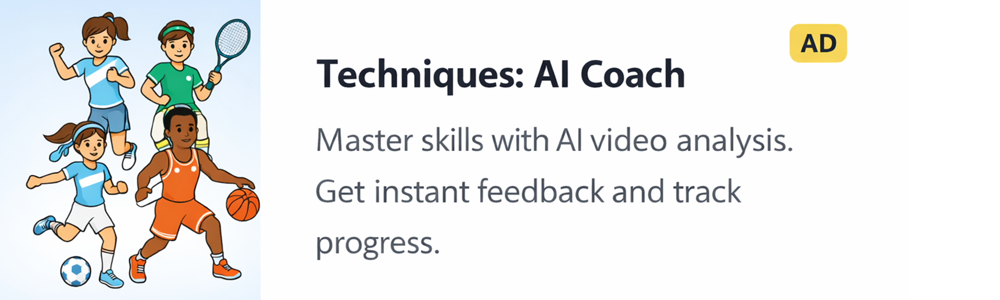
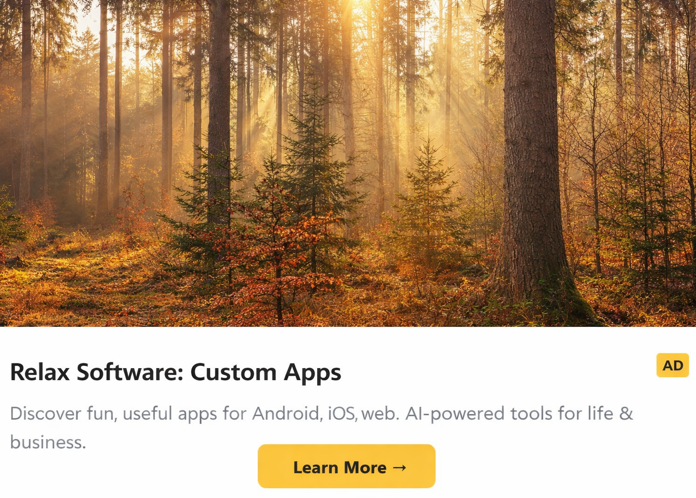

# AdTogether Android SDK

[](https://central.sonatype.com/namespace/com.relaxsoftwareapps.adtogether)
[](https://opensource.org/licenses/MIT)

<p align="center">
  <strong>"Show an ad, get an ad shown"</strong><br>
  The Universal Ad Exchange & Reciprocal Marketing Platform
</p>

---

**AdTogether** is an ad exchange platform designed to empower developers and creators. By participating in our network, you can engage in reciprocal marketing for your own applications while simultaneously driving traffic to your products and helping you **increase conversions**. Our core philosophy is simple: **"Show an ad, get an ad shown"**.

This SDK allows Android developers to easily integrate AdTogether ads into their applications. By displaying ads from other community members, you earn **Ad Credits** that allow your own app's ads to be shown across the AdTogether network.

### 🖼️ Visualizing the Experience

| **Android Banner (Compose)** | **Vertical Interstitial** |
|:---:|:---:|
|  |  |
| *Native Jetpack Compose Banner* | *Full-Screen Immersive Interstitial* |

## Features

- 🎨 **Jetpack Compose** — Native composables for modern Android development.
- ⚖️ **Fair Exchange** — Automated impression and click tracking ensures fair distribution of ad credits.
- 📈 **Increase Conversions** — Promote your app across the network and drive real installs from engaged users.
- 🔌 **Easy Integration** — Distributed via Maven Central for instant setup.

## Getting Started

### 1. Install

Add the dependency to your app-level `build.gradle.kts`:

```kotlin
dependencies {
    implementation("com.relaxsoftwareapps.adtogether:sdk:0.1.10")
}
```

### 2. Initialize

Initialize the SDK early in your application lifecycle. You can obtain your App ID from the [AdTogether Dashboard](https://adtogether.relaxsoftwareapps.com/dashboard).

```kotlin
import com.adtogether.sdk.AdTogether

class MyApplication : Application() {
    override fun onCreate() {
        super.onCreate()
        AdTogether.initialize(context = this, appId = "YOUR_APP_ID")
    }
}
```

## Usage

```kotlin
import androidx.compose.foundation.layout.*
import androidx.compose.runtime.*
import androidx.compose.ui.Modifier
import androidx.compose.ui.unit.dp
import com.adtogether.sdk.views.AdTogetherBanner
import com.adtogether.sdk.views.AdTogetherInterstitial

@Composable
fun MainScreen() {
    var showAd by remember { mutableStateOf(false) }

    Column(modifier = Modifier.fillMaxSize()) {
        // Your App Content Here
        Button(onClick = { showAd = true }) {
            Text("Show Interstitial")
        }

        Spacer(modifier = Modifier.weight(1f))

        // Display the AdTogether Banner
        AdTogetherBanner(
            adUnitId = "YOUR_AD_UNIT_ID",
            onAdLoaded = { println("Banner loaded!") },
            modifier = Modifier
                .fillMaxWidth()
                .height(80.dp)
        )

        // Show Interstitial Ad
        if (showAd) {
            AdTogetherInterstitial(
                adUnitId = "YOUR_INTERSTITIAL_UNIT_ID",
                onAdLoaded = { println("Interstitial loaded!") },
                onDismiss = { showAd = false }
            )
        }
    }
}
```

## How Credits Work

1. **Earn credits** — Every time your app displays an ad from the AdTogether network and the impression is verified, you earn ad credits.
2. **Spend credits** — Your ad credits are automatically spent to show *your* campaigns inside other apps on the network, helping you increase conversions.
3. **Fair weighting** — Different ad formats and geographies have different credit weights, ensuring a level playing field for apps of all sizes.

Create and manage your campaigns from the [AdTogether Dashboard](https://adtogether.relaxsoftwareapps.com/dashboard).

## Additional Information

- 📖 **Documentation**: [adtogether.relaxsoftwareapps.com/docs](https://adtogether.relaxsoftwareapps.com/docs)
- 🐛 **Issues**: [GitHub Issues](https://github.com/undecided2003/AdTogether/issues)
- 💬 **Support**: Join our [Discord community](https://discord.gg/maA8g4ADpk) for real-time help.
- 🌐 **Dashboard**: [adtogether.relaxsoftwareapps.com/dashboard](https://adtogether.relaxsoftwareapps.com/dashboard)

## License

This project is licensed under the MIT License — see the [LICENSE](LICENSE) file for details.
